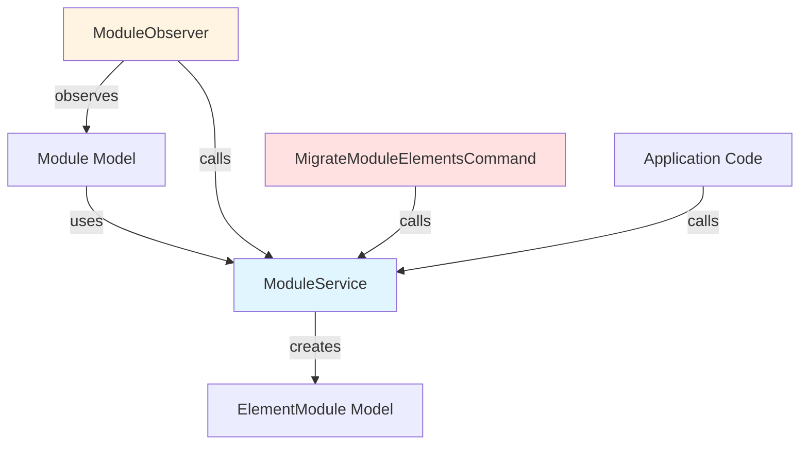

# Design Document: Module Self-Element Reference

## Overview

This feature ensures data integrity by guaranteeing that every Module in the system has at least one associated ElementModule. When a Module exists without any ElementModule records, the system automatically creates a self-referencing ElementModule that inherits the Module's properties.

The solution addresses two scenarios:
1. **Existing Data**: A one-time migration command processes all existing Modules and creates self-referencing elements where needed
2. **New Modules**: Automatic creation of self-referencing elements when new Modules are created without explicit elements

The design follows Laravel best practices by implementing:
- A dedicated service class (ModuleService) for business logic
- An Artisan command for data migration
- Model observers for automatic element creation on new records
- Helper methods for identifying self-referencing elements

## Architecture

### Component Overview



### Service Layer Pattern

The ModuleService acts as the single source of truth for Module-ElementModule business logic. This centralization ensures:
- Consistent behavior across migration, observers, and application code
- Easier testing and maintenance
- Clear separation of concerns

### Transaction Management

All operations that create self-referencing elements use database transactions to ensure atomicity. If Module creation fails, the associated ElementModule creation is rolled back automatically.

## Components and Interfaces

### ModuleService

**Location**: `app/Services/ModuleService.php`

**Responsibilities**:
- Identify Modules without ElementModule records
- Create self-referencing ElementModule records
- Determine if an ElementModule is self-referencing
- Coordinate Module creation with automatic element creation

**Public Methods**:

```php
class ModuleService
{
    /**
     * Get all Modules that have no associated ElementModule records
     * 
     * @return \Illuminate\Database\Eloquent\Collection<Module>
     */
    public function getModulesWithoutElements(): Collection;

    /**
     * Create a self-referencing ElementModule for a given Module
     * Inherits properties from the parent Module
     * 
     * @param Module $module
     * @return ElementModule
     */
    public function createSelfReferencingElement(Module $module): ElementModule;

    /**
     * Determine if an ElementModule is self-referencing
     * Checks if code_element matches parent Module's code_module
     * AND nom_element matches parent Module's nom_module
     * 
     * @param ElementModule $element
     * @return bool
     */
    public function isSelfReferencingElement(ElementModule $element): bool;

    /**
     * Process a single Module to ensure it has at least one element
     * Creates self-referencing element if none exist
     * 
     * @param Module $module
     * @return bool True if element was created, false if skipped
     */
    public function ensureModuleHasElement(Module $module): bool;
}
```

**Implementation Details**:

- `getModulesWithoutElements()`: Uses `doesntHave('elements')` query scope
- `createSelfReferencingElement()`: Maps Module properties to ElementModule:
  - `code_element` ← `code_module`
  - `nom_element` ← `nom_module`
  - `coefficient` ← `1.00` (default coefficient for self-referencing elements)
  - `type_element` ← derived from `type_module` (see mapping below)
  - `id_module` ← `id_module`
  - `id_element_parent` ← `null`

**Note on Coefficient**: Self-referencing elements use a default coefficient of 1.00 rather than inheriting from the module's credits field. This is because:
- The `credits` field represents total academic credits (can be 100+)
- The `coefficient` field represents relative weight within a module (max 99.99 due to database constraint)
- A self-referencing element represents 100% of the module, so coefficient 1.00 is semantically correct

**Type Mapping**:
```
Module.type_module → ElementModule.type_element
CONNAISSANCE → COURS
HORIZONTAL → COURS
STAGE → STAGE_ELEMENT
THESE → AUTRE
```

### ModuleObserver

**Location**: `app/Observers/ModuleObserver.php`

**Responsibilities**:
- Listen to Module model events
- Automatically create self-referencing elements for new Modules

**Lifecycle Hooks**:

```php
class ModuleObserver
{
    public function __construct(private ModuleService $moduleService) {}

    /**
     * Handle the Module "created" event
     * Called after Module is successfully saved to database
     * 
     * @param Module $module
     * @return void
     */
    public function created(Module $module): void;
}
```

**Implementation Strategy**:

The observer uses the `created` event (not `creating`) to ensure the Module has been persisted with an `id_module` before attempting to create the ElementModule. The observer checks if the Module has any elements and creates a self-referencing element if none exist.

**Registration**:

The observer is registered in `AppServiceProvider::boot()`:

```php
Module::observe(ModuleObserver::class);
```

### MigrateModuleElementsCommand

**Location**: `app/Console/Commands/MigrateModuleElementsCommand.php`

**Signature**: `module:migrate-elements`

**Description**: Creates self-referencing ElementModule records for all existing Modules that lack elements

**Responsibilities**:
- Identify all Modules without ElementModule records
- Create self-referencing elements for each
- Provide progress feedback and summary statistics
- Ensure idempotency (safe to run multiple times)

**Command Structure**:

```php
class MigrateModuleElementsCommand extends Command
{
    protected $signature = 'module:migrate-elements';
    
    protected $description = 'Create self-referencing elements for modules without any elements';

    public function __construct(private ModuleService $moduleService) {}

    public function handle(): int;
}
```

**Output Format**:

```
Processing modules without elements...
Progress: [============================] 100%
Created 45 self-referencing elements
Migration completed successfully
```

**Error Handling**:

The command wraps each Module processing in a try-catch block to continue processing even if individual Modules fail. Failed Modules are logged with error details.

## Data Models

### Module

**Table**: `modules`
**Primary Key**: `id_module`

**Relevant Fields**:
- `code_module` (string, unique): Business code (e.g., "ANAT-101")
- `nom_module` (string): Official module name
- `type_module` (enum): CONNAISSANCE, HORIZONTAL, STAGE, THESE
- `credits` (decimal): Credit value

**Relationships**:
- `hasMany(ElementModule::class)` via `id_module`

### ElementModule

**Table**: `elements_module`
**Primary Key**: `id_element`

**Relevant Fields**:
- `id_module` (foreign key): References parent Module
- `id_element_parent` (nullable foreign key): References parent ElementModule
- `code_element` (string): Element code (unique within module)
- `nom_element` (string): Element name
- `type_element` (enum): COURS, TP, PRE_CLINIQUE, STAGE_ELEMENT, AUTRE
- `coefficient` (decimal): Weight coefficient

**Relationships**:
- `belongsTo(Module::class)` via `id_module`
- `belongsTo(ElementModule::class, 'id_element_parent')` for hierarchical elements

**Constraints**:
- Unique constraint on `[id_module, code_element]`
- Cascade delete when parent Module is deleted

