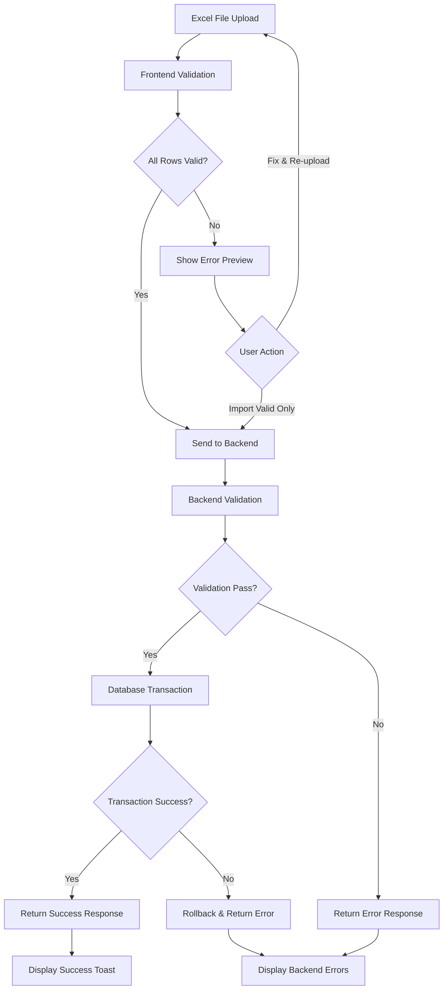

# Design Document: Student Excel Import Validation

## Overview

This design document outlines the improvements to the student Excel import functionality to enforce email validation and provide comprehensive error management. The changes span both backend (Laravel/PHP) and frontend (React/Inertia.js) components.

The key changes include:
1. Removing auto-generation of email addresses
2. Implementing strict validation for all required fields
3. Providing detailed error feedback with row-level information
4. Supporting downloadable error reports

## Architecture



## Components and Interfaces

### Backend Components

#### 1. EtudiantController::bulkStore()
Modified method to handle strict validation without email auto-generation.

```php
interface ImportValidationResult {
    public bool $success;
    public int $created;
    public int $skipped;
    public array $errors; // Array of ImportError
}

interface ImportError {
    public int $row;
    public string $cne;
    public string $nom;
    public string $prenom;
    public string $mail_academique;
    public array $errors; // Array of error messages
}
```

#### 2. Validation Rules
```php
$rules = [
    'cne' => 'required|string|min:2|max:20|unique:etudiants,cne',
    'nom' => 'required|string|min:2|max:50',
    'prenom' => 'required|string|min:2|max:50',
    'mail_academique' => 'required|email|max:100|unique:etudiants,mail_academique',
    'mail_personnel' => 'nullable|email|max:100',
    'date_naissance' => 'nullable|date',
    'telephone' => 'nullable|string|max:20',
    'id_section' => 'nullable|integer|exists:sections,id_section',
];
```

### Frontend Components

#### 1. Display.jsx - Import State
```typescript
interface ImportError {
    row: number;
    cne: string;
    nom: string;
    prenom: string;
    mail_academique: string;
    errors: string[];
}

interface ImportState {
    importFile: File | null;
    importPreview: StudentData[];
    importErrors: ImportError[];
    validStudents: StudentData[];
    isValidating: boolean;
}
```

#### 2. Validation Functions
- `validateEmail(email: string): boolean` - Validates email format
- `validateCNE(cne: string): boolean` - Validates CNE format
- `checkDuplicates(data: StudentData[], field: string): string[]` - Finds duplicates within file
- `checkExistingDuplicates(data: StudentData[], field: string): string[]` - Finds duplicates against database

## Data Models

### Import Request Payload
```json
{
    "students": [
        {
            "cne": "R123456789",
            "nom": "DUPONT",
            "prenom": "Jean",
            "mail_academique": "jean.dupont@etu.example.ma",
            "mail_personnel": "jean@gmail.com",
            "date_naissance": "2000-01-15",
            "telephone": "0612345678",
            "id_section": 1
        }
    ]
}
```

### Import Response (Success)
```json
{
    "success": true,
    "message": "Import réussi: 10 étudiants créés avec succès",
    "created": 10,
    "skipped": 0,
    "errors": []
}
```

### Import Response (Partial/Error)
```json
{
    "success": false,
    "message": "Import partiel: 8 étudiants créés, 2 avec erreurs",
    "created": 8,
    "skipped": 2,
    "errors": [
        {
            "row": 3,
            "cne": "R123456789",
            "nom": "MARTIN",
            "prenom": "Pierre",
            "mail_academique": "",
            "errors": ["Email académique requis"]
        },
        {
            "row": 7,
            "cne": "R987654321",
            "nom": "BERNARD",
            "prenom": "Marie",
            "mail_academique": "invalid-email",
            "errors": ["Format email invalide"]
        }
    ]
}
```


## Correctness Properties

*A property is a characteristic or behavior that should hold true across all valid executions of a system-essentially, a formal statement about what the system should do. Properties serve as the bridge between human-readable specifications and machine-verifiable correctness guarantees.*

### Property 1: Required field validation rejects incomplete data
*For any* student data row missing any required field (cne, nom, prenom, mail_academique), the validation function SHALL return an error containing the specific missing field name.
**Validates: Requirements 1.1, 2.1**

### Property 2: Invalid email format rejection
*For any* string that does not match a valid email pattern (missing @, missing domain, etc.), the email validation function SHALL return false.
**Validates: Requirements 1.2**

### Property 3: Duplicate email detection within file
*For any* collection of student data containing duplicate email addresses, the duplicate detection function SHALL identify all duplicate values and their positions.
**Validates: Requirements 1.3**

### Property 4: Existing email collision detection
*For any* student data with an email that exists in the database, the validation SHALL return an error indicating the email already exists.
**Validates: Requirements 1.4**

### Property 5: Error response structure completeness
*For any* validation error, the error response SHALL contain: row number, student identifiers (cne, nom, prenom, mail_academique), and an array of specific error messages.
**Validates: Requirements 2.2, 3.1**

### Property 6: Import summary accuracy
*For any* import operation, the sum of created count and skipped count SHALL equal the total number of rows in the input.
**Validates: Requirements 3.3**

### Property 7: Validation state determines import eligibility
*For any* set of parsed student data, the import button state (enabled/disabled) SHALL be determined by whether valid rows exist.
**Validates: Requirements 4.1, 4.3**

### Property 8: Only valid rows sent to backend
*For any* import submission, the payload SHALL contain only rows that passed all frontend validation checks.
**Validates: Requirements 4.4**

## Error Handling

### Frontend Error Handling

1. **File Parse Errors**
   - Invalid file format: Display toast "Erreur lors de la lecture du fichier Excel"
   - Empty file: Display toast "Le fichier Excel est vide"

2. **Validation Errors**
   - Display in error table with row numbers
   - Provide downloadable error report
   - Show summary counts (valid/invalid)

3. **Network Errors**
   - Display toast with error message
   - Preserve form state for retry

### Backend Error Handling

1. **Validation Errors**
   - Return 422 status with structured error response
   - Include row numbers and specific field errors

2. **Database Errors**
   - Rollback transaction
   - Return 500 status with generic error message
   - Log detailed error for debugging

3. **Duplicate Key Errors**
   - Catch unique constraint violations
   - Return as validation error with specific field

## Testing Strategy

### Property-Based Testing Library
- **Backend**: Use Pest PHP with custom generators for student data
- **Frontend**: Use fast-check for JavaScript property-based testing

### Unit Tests
- Email validation function
- CNE validation function
- Duplicate detection functions
- Error response formatting

### Property-Based Tests
Each correctness property will be implemented as a property-based test:

1. **Property 1 Test**: Generate random student data with randomly missing required fields, verify validation catches all missing fields
2. **Property 2 Test**: Generate random invalid email strings, verify all are rejected
3. **Property 3 Test**: Generate random student arrays with intentional duplicates, verify all duplicates detected
4. **Property 4 Test**: Generate student data matching existing database records, verify collisions detected
5. **Property 5 Test**: Generate validation errors, verify response structure is complete
6. **Property 6 Test**: Generate import results, verify count arithmetic
7. **Property 7 Test**: Generate parsed data with various valid/invalid combinations, verify button state logic
8. **Property 8 Test**: Generate mixed valid/invalid data, verify only valid rows in payload

### Test Configuration
- Property tests: Minimum 100 iterations per property
- Each test tagged with format: `**Feature: student-excel-import-validation, Property {number}: {property_text}**`
